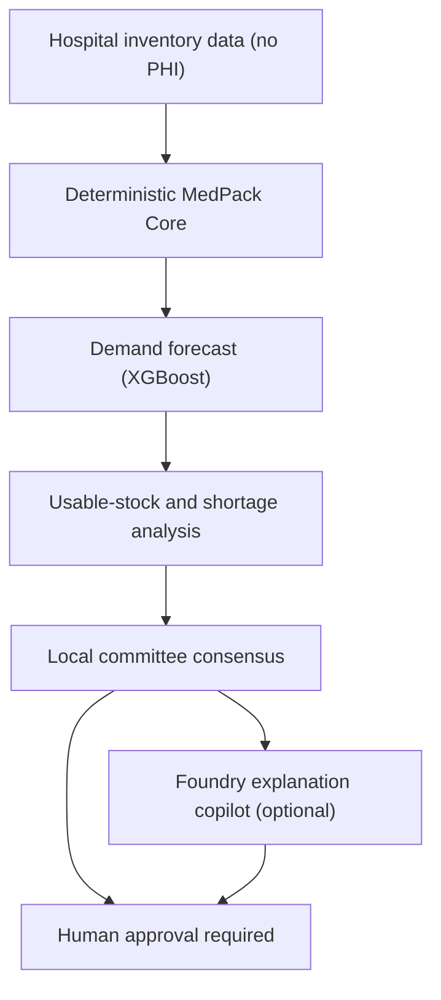
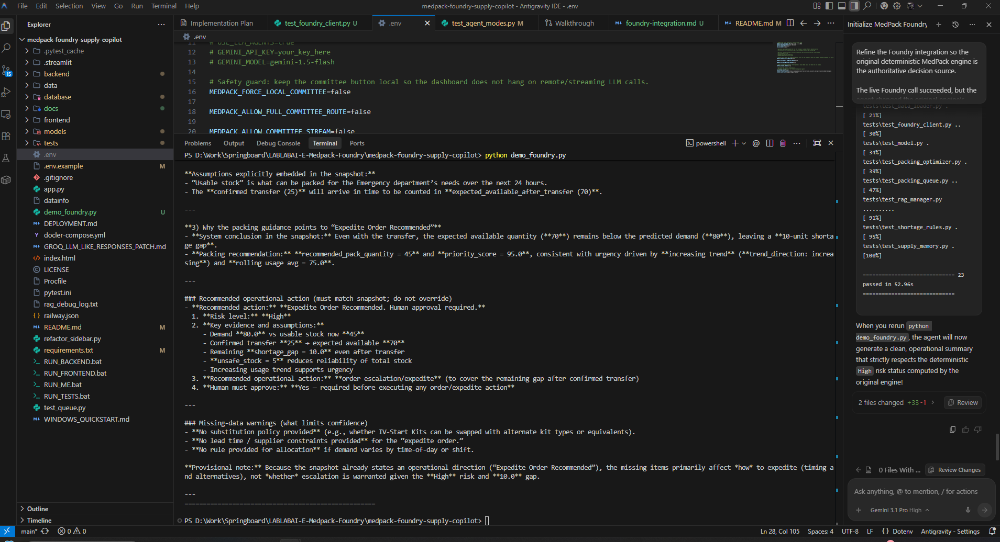

# MedPack AI: Human-Governed Medication Supply Risk Copilot

## Problem Statement
Hospitals face constant supply chain disruptions. When critical supplies (like IV-start kits, specialized tubing, or emergency medications) run low, clinical staff lose valuable time searching for alternatives or waiting for transfers, potentially delaying patient care. Traditional inventory systems provide historical data but lack predictive foresight, operational context, and actionable recommendations.

## Workflow & Solution
MedPack AI bridges the gap between historical inventory data and operational reality. It serves as a **Human-Governed Supply Risk Copilot** that:
1. **Predicts Demand**: Uses an XGBoost model (or fallback rules) based on historical usage, patient volume, and acuity.
2. **Assesses Risk**: Analyzes usable stock vs. total stock (ignoring expired or damaged items).
3. **Prioritizes Action**: Calculates priority scores to recommend packing or staging quantities.
4. **Agentic Review (Optional)**: Uses a multi-agent "Committee" (via Microsoft AI Foundry) to summarize risk, cite clinical policies (RAG), and propose safe mitigation plans (e.g., expedited orders or inter-department transfers).
5. **Human-in-the-Loop**: The system explicitly requires human approval for any recommended action. It does not auto-order supplies or re-route shipments without a human decision-maker.

> **Disclaimer**: This is an operational supply-support tool, strictly for inventory and warehouse management. It is **NOT** a clinical diagnosis or prescribing tool. 

---

## Architecture & Microsoft Foundry Integration

> Microsoft Foundry is an optional explanation copilot; deterministic MedPack calculations and human approval remain authoritative.


MedPack AI leverages **Microsoft AI Foundry** to deploy a multi-agent system (`medpack-supply-copilot`). 
We use the **`gpt-5.4-nano`** model to ensure lightning-fast inference and tight cost-control, making it economically viable to run hundreds of supply checks per hour across a hospital network.



---

## Safety Boundaries & No-PHI Guarantee

To maintain strict HIPAA compliance and patient privacy:
- **No PHI**: MedPack AI operates entirely on de-identified operational metrics (e.g., department volume, acuity levels, aggregate usage).
- **Zero Patient Data**: There are no patient names, IDs/MRNs, diagnoses, addresses, phone numbers, or medical histories in the system.
- **Human Governance**: All recommendations (e.g., "Expedite Order") require explicit human confirmation.

---

## Getting Started

### Local Deterministic Run (Default)
By default, MedPack AI runs entirely locally without needing any cloud API keys or incurring token costs. This ensures the demo is safe, fast, and deterministic.

1. **Install dependencies**:
   ```bash
   pip install -r requirements.txt
   ```
2. **Run the services**:
   ```bash
   python app.py
   ```
3. **Open the Dashboard**: The script will automatically launch the Streamlit frontend (default `http://127.0.0.1:8503`) and the Flask backend (`http://127.0.0.1:5001`).

### Optional: Microsoft Foundry Configuration
To enable the `gpt-5.4-nano` remote agent committee:

1. Copy the example environment file:
   ```bash
   cp .env.example .env
   ```
2. Edit `.env` and set:
   ```env
   USE_FOUNDRY_AGENT=true
   FOUNDRY_PROJECT_ENDPOINT=https://your-ai-services-account.services.ai.azure.com/api/projects/your-project-name
   FOUNDRY_AGENT_NAME=medpack-supply-copilot
   ```
3. Restart the application. The backend will securely connect using Azure SDK standard patterns (`DefaultAzureCredential`).

---

## Synthetic Demo Scenario

We have included a deterministic synthetic scenario to demonstrate the core logic and safety boundaries. 

**The Scenario:**
- **Demand**: 80 IV-start kits required in 24 hours.
- **Supply**: 45 usable now, with a transfer of 25 arriving in 12 hours.
- **Expected Result**: A 10-kit gap (80 - 45 - 25), triggering a **High shortage risk**, an expedited order recommendation, and requiring explicit human approval.

**To run the demo:**
```bash
python demo_foundry.py
```
This script will execute the scenario and output the expected risk analysis and agent committee summary. If `.env` is configured for Azure Foundry, it will use the remote agent; otherwise, it will use the local deterministic engine.

---

## Live Microsoft Foundry Evidence

MedPack Version 1 was tested end-to-end using the deployed `medpack-supply-copilot` agent in Microsoft Foundry.

Verified results:
* The application successfully authenticated through Azure CLI and received HTTP 200 from the Foundry agent endpoint.
* The original deterministic MedPack engine remains the authoritative source of truth.
* Foundry receives the authoritative snapshot and explains it without changing the decision.
* The live synthetic scenario produced:
  * High shortage risk
  * 10-kit gap after a confirmed 25-kit transfer
  * expedited-order recommendation
  * explicit human approval required
* The demo used synthetic, no-PHI operational data only.
* The live test used the low-cost `gpt-5.4-nano` deployment.


*Figure 1: Successful end-to-end Microsoft Foundry live authentication and execution.*


*Figure 2: The deployed medpack-supply-copilot accurately explaining the immutable MedPack risk snapshot.*

---

## Testing Instructions

MedPack AI includes a suite of Pytest tests that run completely offline—no Foundry calls, no paid web search, no RAG dependencies, and no cloud provisioning required.

To run the tests:
```bash
pytest tests/
```
Ensure all tests pass. If you see regressions, verify that no `.env` files with remote settings are polluting the test environment.
