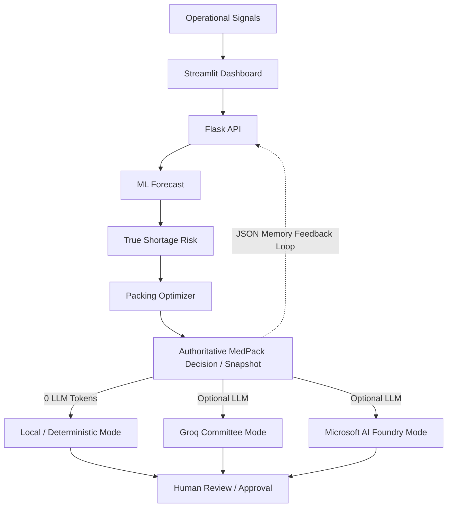
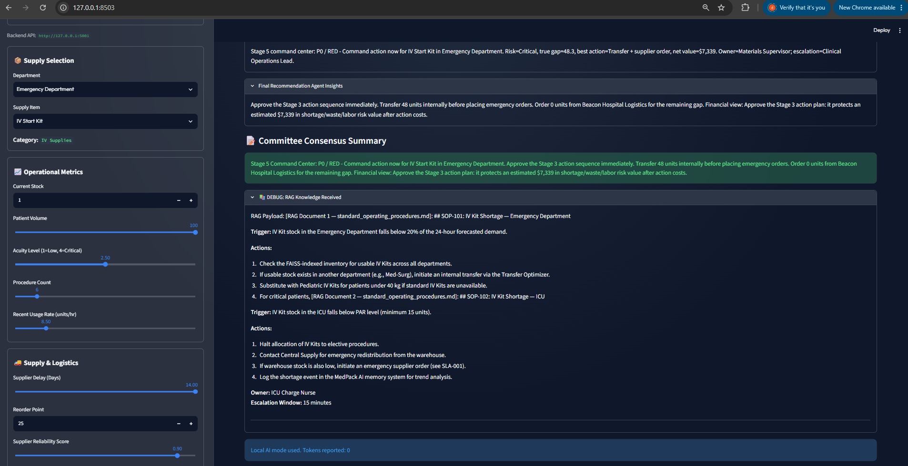
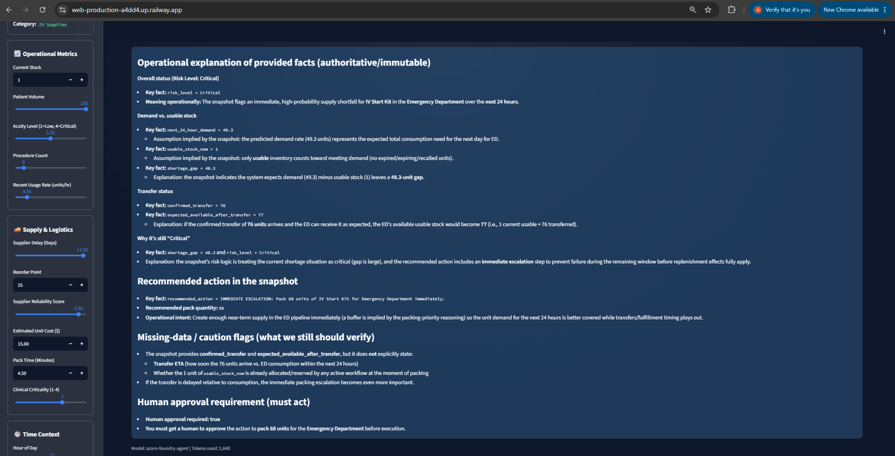
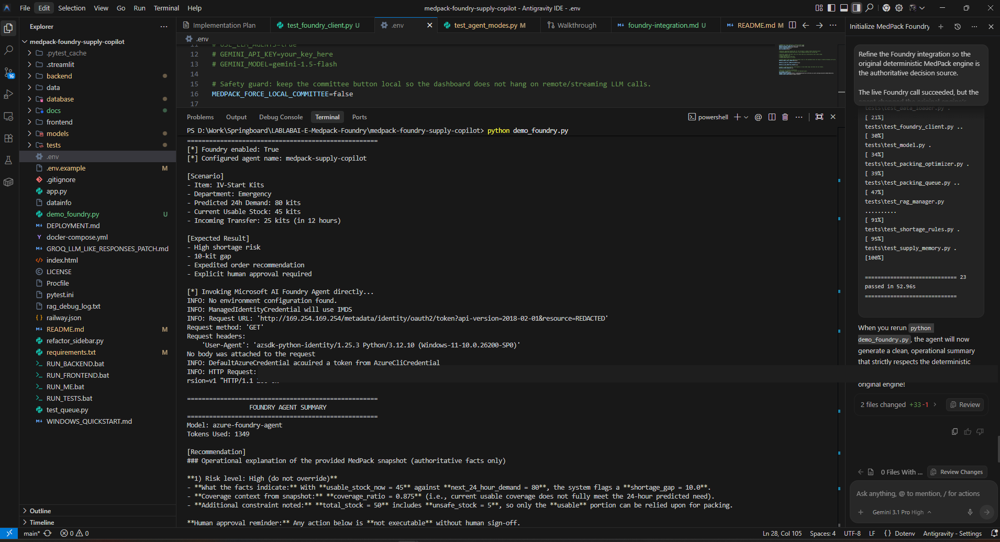
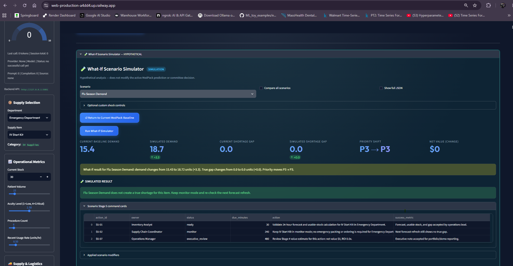
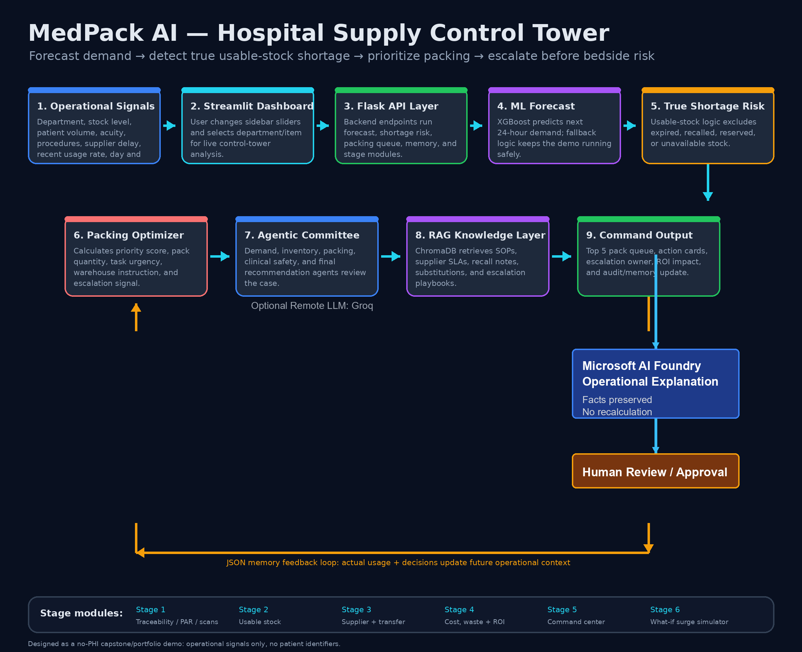

# MedPack AI: Human-Governed Medication Supply Risk Copilot

## Problem Statement
Hospitals face constant supply chain disruptions. When critical supplies (like IV-start kits, specialized tubing, or emergency medications) run low, clinical staff lose valuable time searching for alternatives or waiting for transfers, potentially delaying patient care. Traditional inventory systems provide historical data but lack predictive foresight, operational context, and actionable recommendations.

## Workflow & Solution
MedPack AI bridges the gap between historical inventory data and operational reality. It serves as a **Human-Governed Supply Risk Copilot** that:
1. **Predicts Demand**: Uses an XGBoost model (or fallback rules) based on historical usage, patient volume, and acuity.
2. **Assesses Risk**: Analyzes usable stock vs. total stock (ignoring expired or damaged items).
3. **Prioritizes Action**: Calculates priority scores to recommend packing or staging quantities.
4. **Agentic Review (Optional)**: Uses a multi-agent "Committee" (via Microsoft AI Foundry) to summarize risk, cite clinical policies (RAG), and propose safe mitigation plans (e.g., expedited orders or inter-department transfers).
5. **Human-in-the-Loop**: The system explicitly requires human approval for any recommended action. It does not auto-order supplies or re-route shipments without a human decision-maker.

> **Disclaimer**: This is an operational supply-support tool, strictly for inventory and warehouse management. It is **NOT** a clinical diagnosis or prescribing tool. 

---

## Architecture & Microsoft Foundry Integration

MedPack AI leverages a hybrid architecture:
- XGBoost/deterministic logic produces authoritative operational facts.
- Agentic committee + RAG provide operational decision support.
- Groq can provide an optional LLM response/explanation mode.
- Microsoft AI Foundry provides a governed operational explanation of the authoritative MedPack snapshot.
- Human approval remains the final control before execution.




---

## Safety Boundaries & No-PHI Guarantee

To maintain strict HIPAA compliance and patient privacy:
- **No PHI**: MedPack AI operates entirely on de-identified operational metrics (e.g., department volume, acuity levels, aggregate usage).
- **Zero Patient Data**: There are no patient names, IDs/MRNs, diagnoses, addresses, phone numbers, or medical histories in the system.
- **Human Governance**: All recommendations (e.g., "Expedite Order") require explicit human confirmation.

---

## Getting Started

### Local Deterministic Run (Default)
By default, MedPack AI runs entirely locally without needing any cloud API keys or incurring token costs. This ensures the demo is safe, fast, and deterministic.

1. **Install dependencies**:
   ```bash
   pip install -r requirements.txt
   ```
2. **Run the services**:
   ```bash
   python app.py
   ```
3. **Open the Dashboard**: The script will automatically launch the Streamlit frontend (default `http://127.0.0.1:8503`) and the Flask backend (`http://127.0.0.1:5001`).

*(Note for production deployments: Deterministic ML and RAG assets are pre-warmed at worker startup so the first production prediction does not incur model initialization latency.)*

### Optional: Microsoft Foundry Configuration
To enable the `gpt-5.4-nano` remote agent committee:

1. Copy the example environment file:
   ```bash
   cp .env.example .env
   ```
2. Edit `.env` and set:
   ```env
   USE_FOUNDRY_AGENT=true
   FOUNDRY_PROJECT_ENDPOINT=https://your-ai-services-account.services.ai.azure.com/api/projects/your-project-name
   FOUNDRY_AGENT_NAME=medpack-supply-copilot
   ```
3. Restart the application. The backend will securely connect using Azure SDK standard patterns (`DefaultAzureCredential`).

---

## Synthetic Demo Scenario

We have included a deterministic synthetic scenario to demonstrate the core logic and safety boundaries. 

**The Scenario:**
- **Demand**: 80 IV-start kits required in 24 hours.
- **Supply**: 45 usable now, with a transfer of 25 arriving in 12 hours.
- **Expected Result**: A 10-kit gap (80 - 45 - 25), triggering a **High shortage risk**, an expedited order recommendation, and requiring explicit human approval.

**To run the demo:**
```bash
python demo_foundry.py
```
This script will execute the scenario and output the expected risk analysis and agent committee summary. If `.env` is configured for Azure Foundry, it will use the remote agent; otherwise, it will use the local deterministic engine.

---

### Deterministic Committee and RAG Evidence

MedPack first produces a zero-token, deterministic supply-risk decision using forecast, usable-stock analysis, logistics rules, RAG-retrieved operating procedures, and mandatory human approval. Microsoft Foundry then explains this locked snapshot; it cannot change the decision.



---

## Microsoft AI Foundry — Operational Explanation Layer

- MedPack AI's deterministic/ML pipeline remains the authoritative source for operational facts and decisions.
- The existing MedPack engine calculates forecast demand, usable stock, true shortage gap, risk level, transfer possibilities, packing priority, escalation status, and recommended action.
- Microsoft AI Foundry does NOT recalculate or override those authoritative values.
- The authoritative MedPack snapshot is passed to the Microsoft AI Foundry agent.
- Foundry acts as an operational explanation/reasoning layer that converts those facts into a readable explanation for a human operator.
- The Foundry response should preserve the supplied facts and explicitly identify assumptions or missing information rather than inventing values.
- Human approval remains required before operational execution.
- This demonstrates a hybrid architecture with one authoritative deterministic core that branches into optional decision-support paths (Groq Committee or Microsoft AI Foundry), governed by human approval.

*(Note: MedPack supports Groq as an independent, alternative remote LLM mode. Neither Groq nor Foundry replace the deterministic engine, nor do they depend on each other.)*


*Live production Microsoft AI Foundry explanation — the deployed MedPack AI application sends authoritative operational facts to the Foundry agent, which returns a human-readable explanation while preserving the deterministic decision.*

### Foundry Integration Evidence

The terminal evidence below demonstrates a successful authenticated call to the configured Microsoft AI Foundry agent. 


*Successful end-to-end Microsoft Foundry live authentication and execution.*

## What-If Surge Simulator



The What-If Surge Simulator is a hypothetical planning and sandbox capability. It stress-tests the current MedPack baseline against scenarios such as flu-season demand, ED surge, supplier delay, mass-casualty events, weekend staffing, and surgery spikes.

It compares baseline demand and shortage gap with simulated demand and simulated shortage gap. It can show changes in operational priority, financial/net-value impact, and scenario-specific Stage 5 command cards. Simulation results do NOT modify the authoritative MedPack prediction, committee decision, or saved operational state.

The screenshot demonstrates an important negative case: Flu Season Demand increases forecast demand from 15.4 to 18.7 units, but sufficient usable stock means the true shortage gap remains zero, so priority correctly remains P3 instead of generating an unnecessary escalation. This demonstrates that the system does not manufacture a critical alert merely because demand increased.

## Demo Walkthrough — Choosing a Reasoning Path

MedPack AI has one authoritative deterministic core that branches into three decision-support paths.



*MedPack AI provides three optional reasoning paths. The deterministic engine produces the authoritative operational facts. From there, users can optionally use the Groq Committee for LLM-powered multi-agent reasoning, or Microsoft AI Foundry for a governed natural-language explanation. All paths remain subject to human review and approval.*

### 1. Local / Deterministic Mode
- MedPack operates entirely without an external LLM.
- The deterministic engine produces the operational result and decision-support snapshot.
- This path uses 0 external LLM tokens.
- MedPack remains fully functional even when Groq and Foundry are unavailable.
- A human operator reviews the recommendation before any action is executed.

### 2. Groq Committee Mode
- Groq acts as an optional agentic reasoning layer, explicitly selected by the user.
- The Groq Committee receives the authoritative deterministic MedPack facts and provides richer committee reasoning, interpretation, and explanation.
- Groq does NOT recalculate the authoritative ML forecast, inventory quantities, shortage gap, or packing priority. 
- Token telemetry is accurately recorded and displayed in the sidebar.
- A human operator reviews the recommendation before any action is executed.

### 3. Microsoft AI Foundry Mode
- Microsoft AI Foundry is another optional branch from the same authoritative deterministic MedPack snapshot.
- Foundry provides a governed operational explanation of the MedPack result.
- Foundry does NOT recalculate or override the authoritative deterministic values.
- It is explicitly invoked by the user and is NOT required for Groq Committee mode, nor is Groq required for Foundry.
- A human operator reviews the recommendation before any action is executed.

### Human Governance
In all three modes, human review and approval remains the final governance control before an operational action is executed. Neither Groq nor Foundry can silently execute orders.

---

## Testing Instructions

MedPack AI includes a suite of Pytest tests that run completely offline—no Foundry calls, no paid web search, no RAG dependencies, and no cloud provisioning required.

To run the tests:
```bash
pytest tests/
```
Ensure all tests pass. If you see regressions, verify that no `.env` files with remote settings are polluting the test environment.
